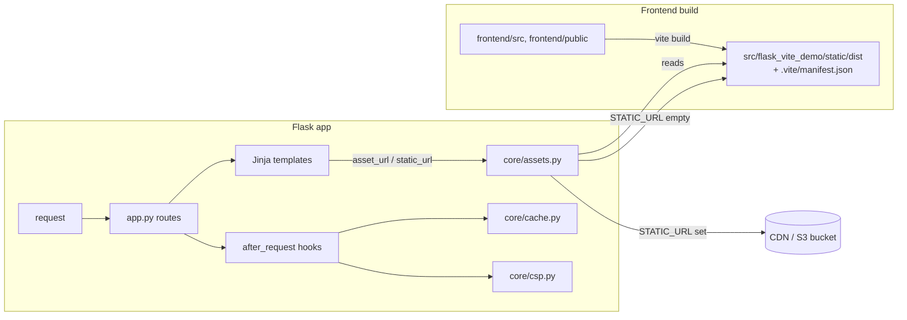

# Architecture

## Current

Two build-time-separate, runtime-joined pieces:

- `app.py` owns routing and registers the two `after_request` hooks
  (`core/cache.py`, `core/csp.py`) plus the Jinja globals (`core/assets.py`).
  Each `core/*` module is independent of the others — none imports another.
- `core/assets.py` is the only module that reads Vite's `manifest.json`; nothing
  else touches the filesystem for asset paths.
- State is entirely in environment variables (`STATIC_URL`) — no database, no
  session store, no cache beyond HTTP `Cache-Control` headers.
- Deploy path: `Dockerfile` builds the frontend once (native arch) and copies its
  output into the Python image; `.github/workflows/cd.yml` additionally extracts
  that same build output to sync straight to S3/CloudFront, so the image and the
  CDN always ship byte-identical assets from one build.

## Target

<!--
  Only if it differs from Current. Note what still has to move, and why.
  Human-curated: agents propose changes to this section as a diff for review,
  rather than editing it in place.
-->
